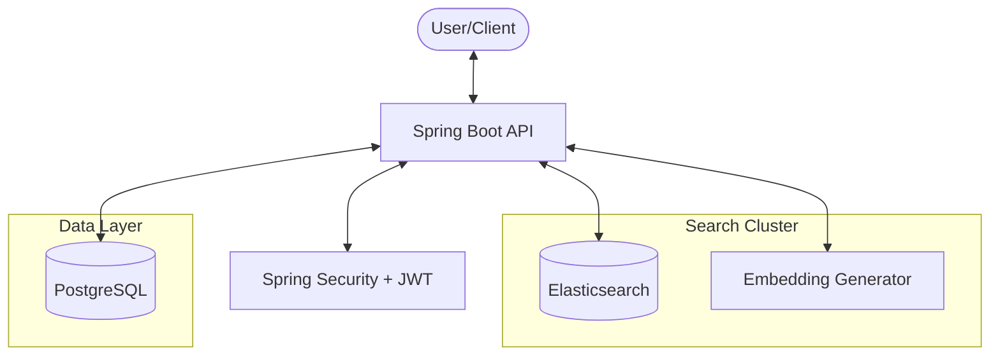
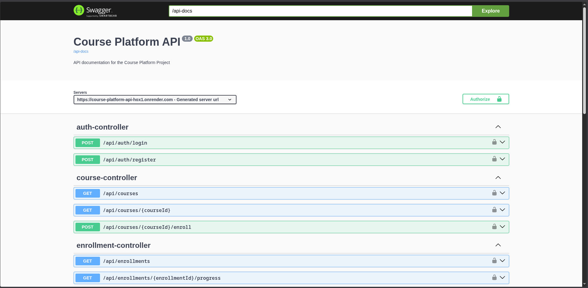
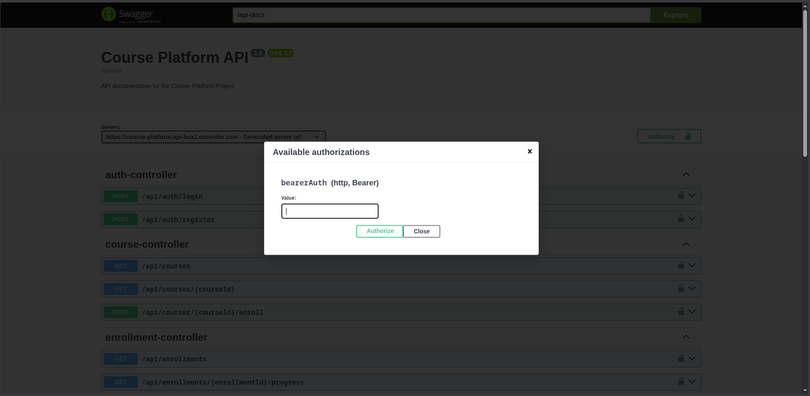
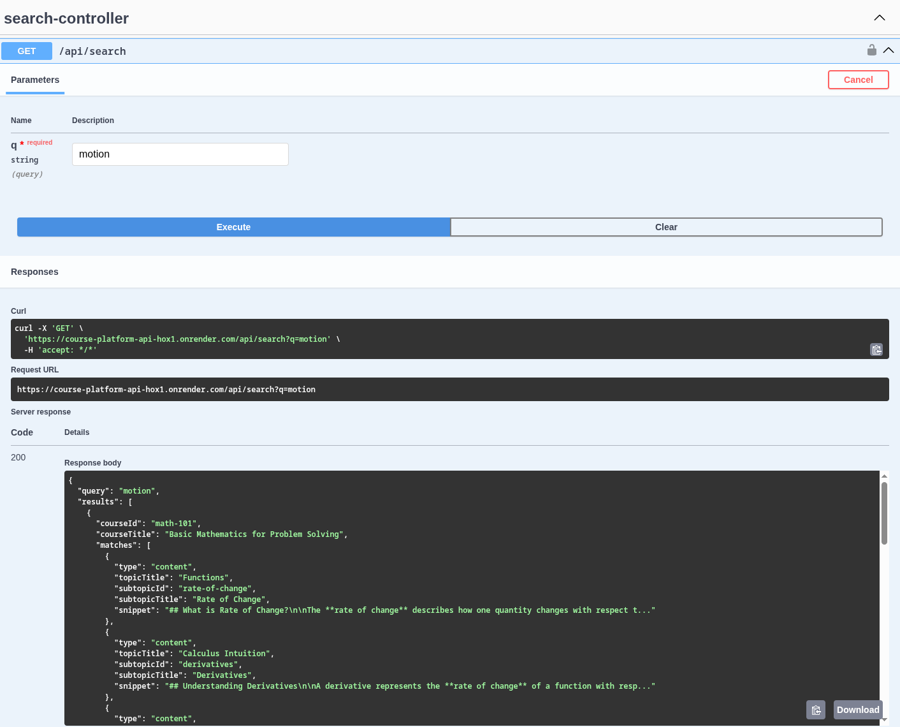
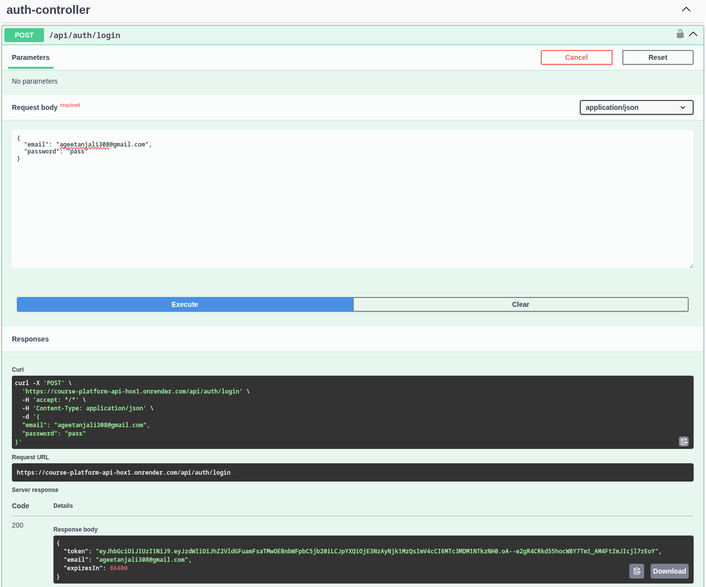

# 🎓 Course Platform API


## 📖 Project Overview
The **Course Platform API** is a high-performance backend system designed for a modern learning management platform. It solves the challenge of content discovery and progress tracking by combining a traditional relational database (PostgreSQL) with advanced search engines (Elasticsearch) and AI-driven semantic understanding. 

Whether a student is searching for specific keywords or looking for courses based on concepts like "how gravity works," the system provides accurate, ranked, and relevant results. The platform also handles secure user lifecycles, from registration and JWT-based authentication to real-time course enrollment and itemized progress reporting.

---

## 🚀 Key Features

### 🔍 Advanced Hybrid Search
- **Fuzzy Matching**: Intelligent keyword search that handles typos and synonyms via Elasticsearch.
- **Semantic Search**: Powered by **Spring AI** to understand the *content meaning*, finding relevant topics even without exact keyword matches.
- **Hierarchical Results**: Search results are cleanly grouped by Course, showing relevant Topics and Subtopics.

### 🛡️ Secure Authentication & Authorization
- **Stateless Security**: Implemented using **JJWT** for secure, token-based interactions.
- **Role-based Protection**: Public endpoints for course browsing and private endpoints for enrollment and progress management.

### 📈 Enrollment & Progress Tracking
- **Course Enrollment**: Instant registration with built-in conflict detection (preventing duplicate enrollments).
- **Granular Progress**: Students can mark individual subtopics as completed.
- **Interactive Reports**: Get completion percentages and detailed history for any enrolled course.

### 🌱 Intelligent Data Seeding
- The application automatically seeds sample courses, topics, and subtopics on first startup and indexes them into Elasticsearch, enabling instant search and testing without manual data setup.


---

## 🏗️ Architecture Diagram
The system follows a modern decoupled architecture for high scalability and performance:



---

## 🔗 Live Demo Links
- **🚀 Live API**: [https://course-platform-api-hox1.onrender.com](https://course-platform-api-hox1.onrender.com)
- **📖 Swagger Documentation**: [https://course-platform-api-hox1.onrender.com/swagger-ui/index.html](https://course-platform-api-hox1.onrender.com/swagger-ui/index.html)

- *Swagger UI can be used to explore and test all API endpoints directly from the browser, with no local setup required.*


---

## 📸 API Documentation & Screenshots

### Interface Overview
The API is fully documented using OpenAPI 3.0. You can explore and test every endpoint directly from the browser.

| Swagger Dashboard | JWT Authorization |
| :---: | :---: |
|  |  |

### Searching & Results
Testing the advanced hybrid search and secure member endpoints.

| Elasticsearch Search | Member Endpoints |
| :---: | :---: |
|  |  |

---

## 🛠️ Tech Stack
- **Backend**: Java 17, Spring Boot 3.2.2
- **Database**: PostgreSQL 15 (Relational Data)
- **Search**: Elasticsearch 7.17 (Keyword/Fuzzy/Ranked Search)
- **AI**: Spring AI (Vector Embeddings for Semantic Search)
- **Security**: Spring Security 6, JJWT
- **Containerization**: Docker & Docker Compose
- **Hosting**: Render (Cloud Deployment)

---

## 🚦 How to Run Locally

### Prerequisites
- JDK 17
- Docker (for Elasticsearch)

### Setup Steps
1. **Clone the Project**
   ```bash
   git clone https://github.com/your-username/Course-Platform-API.git
   cd Course-Platform-API
   ```

2. **Environment Configuration**
   Copy the example and add your local credentials:
   ```bash
   cp .env.example .env
   ```

3. **Start Elasticsearch**
   ```bash
   docker-compose up -d
   ```

4. **Launch Application**
   ```bash
   ./mvnw spring-boot:run
   ```

📍 **Local Swagger**: `http://localhost:8081/swagger-ui/index.html`

---

## 🗺️ Key API Endpoints

| Method | Endpoint | Description |
| :--- | :--- | :--- |
| `POST` | `/api/auth/register` | Create a new user account |
| `GET` | `/api/search?q={query}` | Advanced Hybrid Search |
| `POST` | `/api/courses/{id}/enroll` | Enroll in a course (Auth Required) |
| `GET` | `/api/enrollments/{id}/progress` | View detailed completion stats |

---

## 🔎 Search Examples
- **Standard**: `GET /api/search?q=java`
- **Typo Tolerance**: `GET /api/search?q=physcis` (Fuzzy matching)
- **Semantic/Conceptual**: `GET /api/search?q=how the universe began` (AI semantic match)

---

## 🔮 Future Improvements
- Integration of AWS S3 for course video hosting.
- Implementation of a Review/Rating system for courses.
- Real-time study groups using WebSockets.
- Mobile-native application frontend.

---
*Created for excellence in modern API design.*